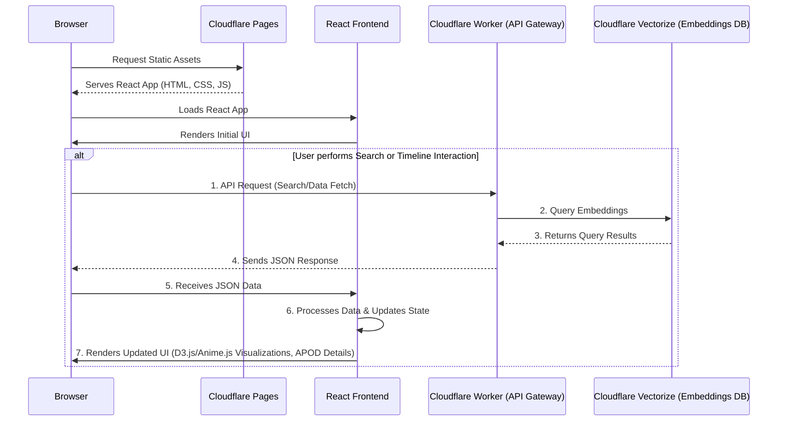

# apod-imagery

This project implements a comprehensive pipeline for processing NASA APOD (Astronomy Picture of the Day) data, generating semantic embeddings, storing images, and serving them through a performant web application. It also includes a robust model evaluation framework.

## Architecture Overview

### Web Application & Frontend

