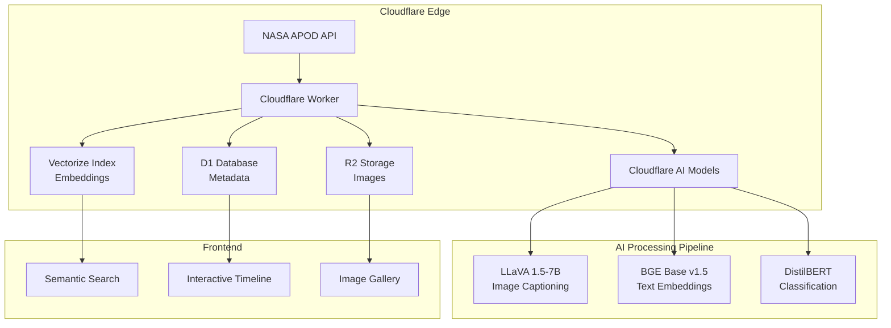
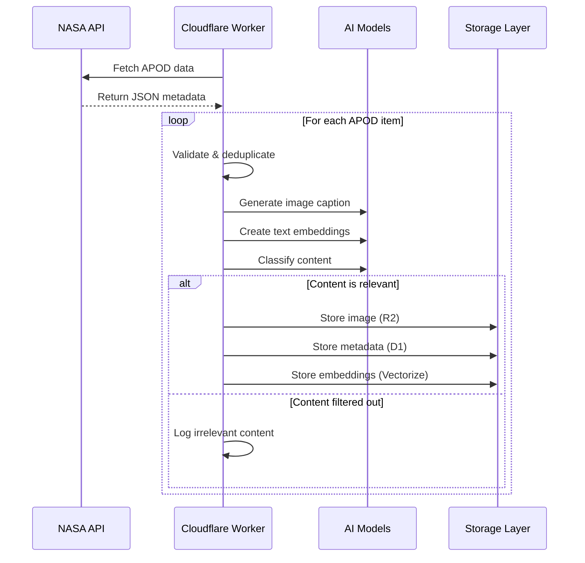

# APOD Imagery :telescope:

> A production-ready pipeline for processing NASA's Astronomy Picture of the Day (APOD) data with semantic search, intelligent image analysis, and interactive visualizations powered by Cloudflare's edge computing platform.

## Overview

This project implements a comprehensive, cloud-native system for processing and analyzing NASA's APOD archive. Built on Cloudflare Workers, it combines multiple AI models to generate semantic embeddings, classify astronomical content, and enable intelligent search across 25+ years of space imagery and descriptions.


## :sparkles: Key Features

- **Production-Ready Pipeline**: Robust error handling, retry logic, and transactional data consistency
- **Edge-Powered AI**: Real-time inference using Cloudflare's distributed AI platform
- **Semantic Search**: Vector-based search across APOD descriptions and AI-generated image captions
- **Smart Classification**: Automated categorization of astronomical phenomena and celestial objects
- **Scalable Architecture**: Configurable concurrency control and batch processing for high throughput
- **Comprehensive Monitoring**: Detailed metrics, error tracking, and performance analytics

## :building_blocks: Architecture

### System Overview



## :robot: AI Models & Processing Pipeline

### Model Configuration

| Model | Purpose | Output | Production Notes |
|-------|---------|--------|------------------|
| `@cf/llava-hf/llava-1.5-7b-hf` | **Vision-Language** | Image descriptions | Specialized astronomical prompting |
| `@cf/baai/bge-base-en-v1.5` | **Text Embedding** | 768-dimensional vectors | Optimized for cosine similarity |
| `@cf/huggingface/distilbert-sst-2-int8` | **Text Classification** | Sentiment/category scores | Currently limited - needs astronomy-specific model |
| `@cf/facebook/detr-resnet-50` | **Object Detection** | Bounding boxes + labels | Available for future enhancement |
| `@cf/microsoft/resnet-50` | **Image Classification** | Image categories | Available for future enhancement |

### Processing Workflow



### Data Processing Flow

```mermaid
graph TD
    A[APOD Data<br/>(Image + Text)] --> B{Multi-Modal Feature Extraction};
    B --> C[Llava<br/>(Image Captioning)];
    B --> D[Image Classification<br/>(e.g., ResNet)];
    B --> E[Text Summarization];
    
    C --> F[Combined Text<br/>(Original + Llava + Summaries)];
    D --> F;
    E --> F;
    
    F --> G[Text Embedding Model<br/>(e.g., BGE)];
    G --> H{Quality Assurance<br/>(CelestialImageValidator)};
    H --> I[Vector Database Storage];
```

## :gear: Production Configuration

### Environment Variables

```bash
# Processing Configuration
MAX_CONCURRENT_PROCESSING=5     # Concurrent AI model calls
BATCH_SIZE=10                   # Items per processing batch
RETRY_ATTEMPTS=3                # Retry failed operations
ENABLE_DETAILED_LOGGING=true    # Verbose processing logs

# Cloudflare Resources
AI=your-ai-binding
VECTORIZE_INDEX=apod-vectorize-index
APOD_R2=apod-images-bucket
APOD_D1=apod-metadata-db
```

### Vectorize Index Configuration

Based on the BGE model specifications:

```typescript
// Vectorize index must be configured with:
{
  dimensions: 768,           // BGE model output size
  metric: "cosine",         // Optimal for text embeddings
  description: "APOD semantic embeddings using BGE base model"
}
```

## :chart_with_upwards_trend: Model Evaluation & Monitoring

### Current Evaluation Framework

The system includes comprehensive evaluation capabilities:

**Embedding Quality Assessment:**
- **Model**: BGE Base EN v1.5 (768-dimensional)
- **Distance Metric**: Cosine similarity (recommended for text)
- **Suitability**: General-purpose model appropriate for astronomical text

**Production Metrics:**
```typescript
interface ProcessingMetrics {
  processed: number;        // Successfully processed items
  failed: number;          // Failed processing attempts  
  skipped: number;         // Already processed/filtered
  relevant: number;        // Classified as relevant content
  irrelevant: number;      // Filtered out content
  errors: Array<{          // Detailed error tracking
    date: string;
    error: string;
    step: string;
  }>;
}
```

### Known Limitations & Improvements Needed

**⚠️ Critical Areas for Enhancement:**

1. **Classification Model**: Current DistilBERT model is designed for sentiment analysis, not astronomical content
   ```typescript
   // Current simplistic filtering - needs improvement
   private isCelestialObject(category: string): boolean {
     const celestialCategories = ["Galaxy", "Nebula", "Star Cluster", "Planet", "Comet", "Asteroid", "Supernova", "Black Hole"];
     return celestialCategories.includes(category);
   }
   ```

2. **Model Performance Metrics**: Need to implement:
   - Precision@K and Recall@K for search relevance
   - BLEU/ROUGE scores for caption quality
   - Classification accuracy on astronomical content

3. **Monitoring Gaps**: Missing observability for:
   - Embedding cluster quality
   - Search result relevance tracking
   - Model drift detection

## :rocket: Performance & Scalability

### Current Performance Characteristics

- **Processing Rate**: ~2-5 items/second (configurable)
- **Error Recovery**: 3-attempt retry with exponential backoff
- **Concurrency Control**: Semaphore-based limiting prevents resource exhaustion
- **Memory Efficiency**: Streaming image processing without full buffering

### Scalability Features

```typescript
// Configurable batch processing
private async processBatchWithConcurrency(batch: APODData[]): Promise<void> {
  const semaphore = new Semaphore(this.maxConcurrent);
  // Prevents overwhelming Cloudflare AI with too many concurrent requests
}

// Transactional storage with rollback
private async storeAPODData(...): Promise<void> {
  try {
    await this.env.APOD_R2.put(r2Key, imageBlob);
    await db.prepare(INSERT_QUERY).run();
    await this.env.VECTORIZE_INDEX.upsert([vector]);
  } catch (error) {
    // Automatic cleanup on failure
    await this.env.APOD_R2.delete(r2Key).catch(() => {});
    await db.prepare(DELETE_QUERY).run().catch(() => {});
    throw error;
  }
}
```

## :warning: Production Considerations

### Security & Compliance
- All images stored in private R2 buckets
- Metadata sanitized before storage
- Rate limiting prevents API abuse
- Error messages sanitized to prevent information leakage

### Cost Optimization
- Configurable processing limits prevent runaway costs
- Deduplication prevents reprocessing existing content
- Efficient batch processing minimizes compute usage

### Monitoring & Alerting
```typescript
// Recommended CloudWatch/monitoring setup
{
  "processing_rate": "items/second",
  "error_rate": "percentage", 
  "storage_usage": "GB",
  "vectorize_operations": "count/minute"
}
```

## :page_facing_up: License

MIT License - see [LICENSE](LICENSE) file for details.

## :link: Resources

- [NASA APOD API Documentation](https://api.nasa.gov/)
- [Cloudflare AI Documentation](https://developers.cloudflare.com/ai/)
- [BGE Embedding Model Details](https://huggingface.co/BAAI/bge-base-en-v1.5)
- [Vectorize Configuration Guide](https://developers.cloudflare.com/vectorize/)

---

**Built for production astronomical data processing with ❤️ and ☁️**