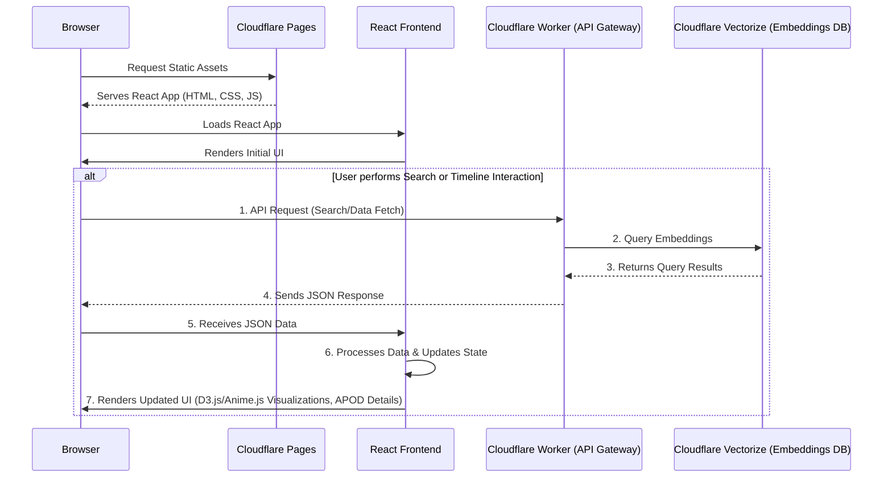

# apod-imagery

This project implements a comprehensive pipeline for processing NASA APOD (Astronomy Picture of the Day) data, generating semantic embeddings, storing images, and serving them through a performant web application. It also includes a robust model evaluation framework.

## Architecture Overview

### Web Application & Frontend

## Models Used

This project uses a variety of models from the Cloudflare AI catalog to perform different tasks:

*   **Image-to-Text**: `@cf/llava-hf/llava-1.5-7b-hf` is used to generate text descriptions of the APOD images.
*   **Text Classification**: `@cf/huggingface/distilbert-sst-2-int8` is used to classify the APOD text into different categories.
*   **Text Embedding**: `@cf/baai/bge-base-en-v1.5` is used to generate vector embeddings for the APOD text.
*   **Object Detection**: `@cf/facebook/detr-resnet-50` can be used for object detection in the images.
*   **Image Classification**: `@cf/microsoft/resnet-50` can be used for image classification.
