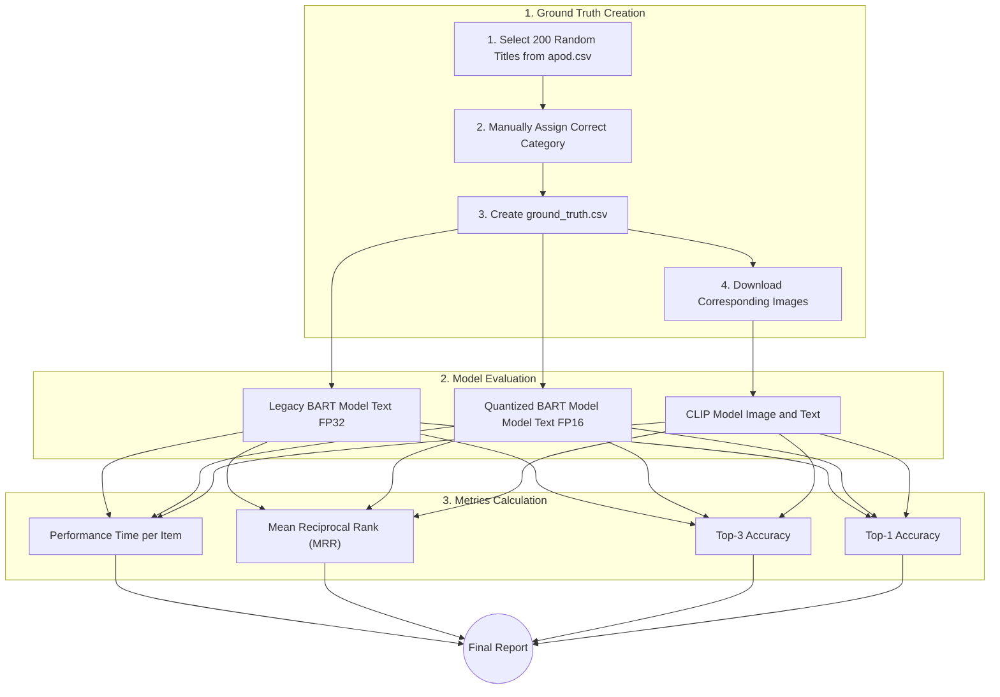

# apod-imagery

## Architecture Overview

```mermaid
graph TD
    A[APOD Source (NASA API)] --> B(Data Ingestion Pipeline - Python Scripts)
    B --> C(Cloudflare Vectorize: Embeddings DB)
    B --> D(Cloudflare Images: Image Storage)
    E[React Frontend (Cloudflare Pages)] --> F(Cloudflare Workers: API Gateway)
    F --> C
    F --> D
    C -- Embeddings --> F
    D -- Image URLs --> F
    F -- JSON Data --> E
    E -- User Interaction --> E
```

**Explanation:**
*   **APOD Source:** The original source of APOD data (NASA API).
*   **Data Ingestion Pipeline (Python Scripts):** Your local Python scripts that fetch new APOD data, extract relevant information (title, explanation, image URL), generate embeddings, and prepare data for Cloudflare services.
*   **Cloudflare Vectorize:** Stores the vector embeddings of APOD titles/explanations, enabling fast semantic similarity searches.
*   **Cloudflare Images:** Stores and optimizes all APOD images, serving them efficiently via CDN for the web application.
*   **React Frontend (Cloudflare Pages):** The client-side application, deployed on Cloudflare Pages, where users interact with the semantic search and visualizations.
*   **Cloudflare Workers (API Gateway):** Acts as the backend for the frontend, receiving search queries, querying Vectorize and Images, and returning structured data to the React app.

## Model Evaluation and Benchmarking

To ensure both accuracy and performance, this project includes a comprehensive evaluation pipeline to compare different classification models. The goal is to measure the impact of optimization techniques (like quantization) and compare text-based models against more advanced multimodal (text + image) models.



**Evaluation Workflow:**

1.  **Ground Truth Creation:**
    *   A random subset of APOD entries is selected.
    *   Each entry is manually assigned a "golden" category, creating a reliable `ground_truth.csv` file.
    *   The actual images for these ground truth entries are downloaded for multimodal analysis.

2.  **Model Comparison:**
    *   **Legacy BART:** The original, full-precision (`float32`) text-based classifier (`facebook/bart-large-mnli`).
    *   **Quantized BART:** The optimized, half-precision (`float16`) version of the same text-based model.
    *   **CLIP Model:** A state-of-the-art multimodal model that uses both the image and the text to make a prediction.

3.  **Metrics:**
    *   **Accuracy:** We use standard ranking metrics to evaluate how well each model predicts the correct category.
        *   **Top-N Accuracy:** Is the correct answer in the top 1 or top 3 predictions?
        *   **Mean Reciprocal Rank (MRR):** How high up the list is the correct answer, on average?
    *   **Performance:** We measure the processing speed (time per item) to quantify the efficiency gains from quantization.

This process provides a clear, data-driven comparison to select the best model that balances accuracy and performance for the application's needs.


## Data Ingestion and Processing Pipeline

This pipeline is responsible for fetching APOD data, generating embeddings, and preparing images for the Cloudflare-based web application.

```mermaid
graph TD
    A[APOD NASA API] --> B{Python Script: process_apod.py}
    B --> C[Extract Title, Explanation, Image URL, Metadata]
    C --> D[Local Storage: apod_master_data.csv (Full Metadata)]
    D --> E{Python Script: download_all_images.py (for local analysis/evaluation)}
    E --> F[Local Storage: images/ (Actual Image Files)]
    D --> G{Python Script: upload_to_cloudflare_images.py (for web app serving)}
    G --> H(Cloudflare Images API)
    D --> I[Python Script: generate_embeddings.py (for web app search)]
    I --> J(Cloudflare Vectorize API)
```

**Explanation:**
*   **Python Script (`process_apod.py`):** Fetches APOD data from the NASA API, including title, explanation, image URLs, and other metadata. It's designed to be robust with rate-limiting and resumable.
*   **Local Storage (`apod_master_data.csv`):** A comprehensive CSV file storing all fetched metadata. This serves as the single source of truth for all APOD entries.
*   **Python Script (`download_all_images.py`):** Reads `apod_master_data.csv` and downloads the actual image files to a local `images/` directory. This is primarily for local analysis, multimodal model evaluation, and development purposes.
*   **Python Script (`upload_to_cloudflare_images.py`):** This *future* script will read `apod_master_data.csv` and intelligently upload images to Cloudflare Images for serving via the web application. This script will handle copyright considerations by only uploading public domain images or hotlinking to NASA's URLs where appropriate.
*   **Python Script (`generate_embeddings.py`):** This *future* script will read `apod_master_data.csv`, generate various types of embeddings (title-only, text-enriched, multimodal), and push them to Cloudflare Vectorize.
*   **Cloudflare Images:** Stores and optimizes images for global delivery to the web application.
*   **Cloudflare Vectorize:** Stores vector embeddings, enabling efficient semantic similarity searches for the web application.

## Frontend Interaction and Visualization Flow

This diagram illustrates how the React frontend (deployed on Cloudflare Pages) interacts with the Cloudflare backend (Workers, Vectorize, Images) to perform semantic searches and display visualizations.

```mermaid
graph TD
    A[React Frontend (Cloudflare Pages)] --> B{User Search Query / Timeline Interaction}
    B --> C(Cloudflare Worker API Gateway)
    C --> D(Cloudflare Vectorize Query Embeddings)
    C --> E(Cloudflare Images Get Image URLs)
    D -- Top K Results (IDs) --> C
    E -- Image URLs --> C
    C -- Combined Data (JSON) --> A
    A --> F[D3.js  Anime.js Visualizations]
    A --> G[Display Categorized Data / APOD Details]
```

**Explanation:**
*   **React Frontend (Cloudflare Pages):** The client-side application, deployed on Cloudflare Pages, handles user interaction and renders the UI.
*   **User Search Query / Timeline Interaction:** User actions trigger requests to the backend.
*   **Cloudflare Worker API Gateway:** This serverless function acts as the central API. It receives requests, orchestrates data retrieval from Vectorize and Images, and prepares responses for the frontend.
*   **Cloudflare Vectorize (Query Embeddings):** Performs semantic similarity searches based on user queries.
*   **Cloudflare Images (Get Image URLs):** Provides optimized image URLs for display.
*   **Combined Data (JSON):** The Worker sends a JSON response containing search results, timeline data, or specific APOD details (title, explanation, image URL, copyright) back to the frontend.
*   **D3.js / Anime.js Visualizations:** The React app uses these libraries to render interactive visualizations, including the circular timeline.
*   **Display Categorized Data / APOD Details:** Presents the fetched APOD entries and their details to the user.


