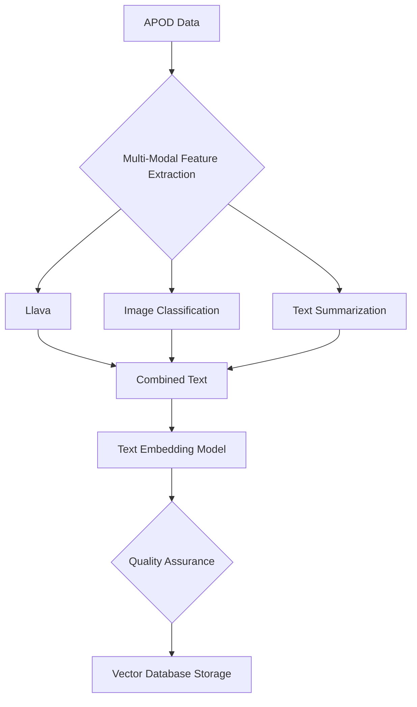

# APOD Imagery :telescope:

> A production-ready pipeline for processing NASA's Astronomy Picture of the Day (APOD) data with semantic search, intelligent image analysis, and interactive visualizations powered by Cloudflare's edge computing platform.

## Overview

This project implements a comprehensive, cloud-native system for processing and analyzing NASA's APOD archive. Built on Cloudflare Workers, it combines multiple AI models to generate semantic embeddings, classify astronomical content, and enable intelligent search across 25+ years of space imagery and descriptions.


## :sparkles: Key Features

- **Production-Ready Pipeline**: Robust error handling, retry logic, and transactional data consistency
- **Edge-Powered AI**: Real-time inference using Cloudflare's distributed AI platform
- **Semantic Search**: Vector-based search across APOD descriptions and AI-generated image captions
- **Smart Classification**: Automated categorization of astronomical phenomena and celestial objects
- **Scalable Architecture**: Configurable concurrency control and batch processing for high throughput
- **Comprehensive Monitoring**: Detailed metrics, error tracking, and performance analytics

## :building_blocks: Architecture

### System Overview


## :robot: AI Models & Processing Pipeline

### Model Configuration

| Model | Purpose | Output | Production Notes |
|-------|---------|--------|------------------|
| `@cf/llava-hf/llava-1.5-7b-hf` | **Vision-Language** | Image descriptions | LLaVA is an open-source chatbot trained by fine-tuning LLaMA/Vicuna on GPT-generated multimodal instruction-following data. It is an auto-regressive language model, based on the transformer architecture. |
| `@cf/baai/bge-base-en-v1.5` | **Text Embedding** | 768-dimensional vectors | BAAI general embedding (Base) model that transforms any given text into a 768-dimensional vector. Optimized for cosine similarity. |
| `@cf/huggingface/distilbert-sst-2-int8` | **Text Classification** | Sentiment/category scores | Distilled BERT model that was finetuned on SST-2 for sentiment classification. Currently limited - needs astronomy-specific model. |
| `@cf/facebook/detr-resnet-50` | **Object Detection** | Bounding boxes + labels | Available for future enhancement. |
| `@cf/microsoft/resnet-50` | **Image Classification** | Image categories | 50 layers deep image classification CNN trained on more than 1M images from ImageNet. Available for future enhancement. |
| `@cf/baai/bge-reranker-base` | **Text Reranking** | Relevance score | Different from embedding model, reranker uses question and document as input and directly output similarity instead of embedding. You can get a relevance score by inputting query and passage to the reranker. And the score can be mapped to a float value in [0,1] by sigmoid function. Available for future enhancement. |
| `@cf/baai/bge-m3` | **Text Embeddings** | Multi-dimensional vectors | Multi-Functionality, Multi-Linguality, and Multi-Granularity embeddings model. Available for future enhancement. |
| `@cf/unum/uform-gen2-qwen-500m` | **Image-to-Text** | Image descriptions | UForm-Gen is a small generative vision-language model primarily designed for Image Captioning and Visual Question Answering. The model was pre-trained on the internal image captioning dataset and fine-tuned on public instructions datasets: SVIT, LVIS, VQAs datasets. Available for future enhancement. |
| `@cf/facebook/bart-large-cnn` | **Summarization** | Summarized text | BART is a transformer encoder-encoder (seq2seq) model with a bidirectional (BERT-like) encoder and an autoregressive (GPT-like) decoder. You can use this model for text summarization. Available for future enhancement. |
| `@cf/baai/bge-large-en-v1.5` | **Text Embeddings** | 1024-dimensional vectors | BAAI general embedding (Large) model that transforms any given text into a 1024-dimensional vector. Available for future enhancement. |
| `@cf/baai/bge-small-en-v1.5` | **Text Embeddings** | 384-dimensional vectors | BAAI general embedding (Small) model that transforms any given text into a 384-dimensional vector. Available for future enhancement. |

### Processing Workflow


### Data Processing Flow



## :gear: Production Configuration

### Environment Variables

```bash
# Processing Configuration
MAX_CONCURRENT_PROCESSING=5     # Concurrent AI model calls
BATCH_SIZE=10                   # Items per processing batch
RETRY_ATTEMPTS=3                # Retry failed operations
ENABLE_DETAILED_LOGGING=true    # Verbose processing logs

# Cloudflare Resources
AI=your-ai-binding
VECTORIZE_INDEX=apod-vectorize-index
APOD_R2=apod-images-bucket
APOD_D1=apod-metadata-db
```

### Vectorize Index Configuration

Based on the BGE model specifications:

```typescript
// Vectorize index must be configured with:
{
  dimensions: 768,           // BGE model output size
  metric: "cosine",         // Optimal for text embeddings
  description: "APOD semantic embeddings using BGE base model"
}
```

## :chart_with_upwards_trend: Model Evaluation & Monitoring

### Current Evaluation Framework

The system includes comprehensive evaluation capabilities:

**Embedding Quality Assessment:**
- **Model**: BGE Base EN v1.5 (768-dimensional)
- **Distance Metric**: Cosine similarity (recommended for text)
- **Suitability**: General-purpose model appropriate for astronomical text

**Production Metrics:**
```typescript
interface ProcessingMetrics {
  processed: number;        // Successfully processed items
  failed: number;          // Failed processing attempts  
  skipped: number;         // Already processed/filtered
  relevant: number;        // Classified as relevant content
  irrelevant: number;      // Filtered out content
  errors: Array<{          // Detailed error tracking
    date: string;
    error: string;
    step: string;
  }>;
}
```

## :warning: Production Considerations

### Security & Compliance
- All images stored in private R2 buckets
- Metadata sanitized before storage
- Rate limiting prevents API abuse
- Error messages sanitized to prevent information leakage

### Cost Optimization
- Configurable processing limits prevent runaway costs
- Deduplication prevents reprocessing existing content
- Efficient batch processing minimizes compute usage

### Monitoring & Alerting
```typescript
// Recommended CloudWatch/monitoring setup
{
  "processing_rate": "items/second",
  "error_rate": "percentage", 
  "storage_usage": "GB",
  "vectorize_operations": "count/minute"
}
```

## :page_facing_up: License

MIT License - see [LICENSE](LICENSE) file for details.

## :link: Resources

- [NASA APOD API Documentation](https://api.nasa.gov/)
- [Cloudflare AI Documentation](https://developers.cloudflare.com/ai/)
- [BGE Embedding Model Details](https://huggingface.co/BAAI/bge-base-en-v1.5)
- [Vectorize Configuration Guide](https://developers.cloudflare.com/vectorize/)

---

**Built for production astronomical data processing with ❤️ and ☁️**