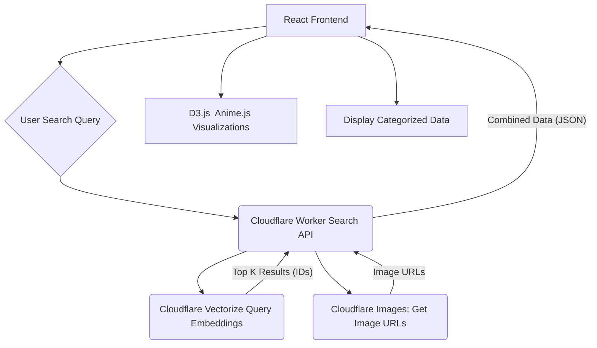

# APOD Image Detective: Cloudflare-Powered Architecture

This document outlines the proposed architecture for the APOD Image Detective application, leveraging Cloudflare's edge computing and data storage services. The focus is on semantic search and data visualization, excluding interactive chat functionalities for initial feasibility.

## 1. Overall System Architecture

The system is designed as a serverless, edge-first application to ensure low-latency access and scalability.

```mermaid
graph TD
    A[APOD Source (NASA API/Scrape)] --> B(Data Ingestion Pipeline - Python Scripts)
    B --> C(Cloudflare Vectorize: Embeddings DB)
    B --> D(Cloudflare Images: Image Storage)
    E[React Frontend] --> F(Cloudflare Workers: API Gateway)
    F --> C
    F --> D
    C -- Embeddings --> F
    D -- Image URLs --> F
    F -- JSON Data --> E
    E -- User Interaction --> E
```

**Explanation:**
*   **APOD Source:** The original source of APOD data (NASA API or web scraping).
*   **Data Ingestion Pipeline (Python Scripts):** Your local Python scripts that fetch new APOD data, extract relevant information (title, explanation, image URL), generate embeddings, and upload images to Cloudflare services.
*   **Cloudflare Vectorize:** Stores the vector embeddings of APOD titles/explanations, enabling fast semantic similarity searches.
*   **Cloudflare Images:** Stores and optimizes all APOD images, serving them efficiently via CDN.
*   **React Frontend:** The client-side application where users interact with the semantic search and visualizations.
*   **Cloudflare Workers (API Gateway):** Acts as the backend for the frontend, receiving search queries, querying Vectorize and Images, and returning structured data to the React app.

## 2. Data Ingestion and Processing Pipeline

This pipeline is responsible for populating Cloudflare Vectorize and Cloudflare Images with APOD data, driven by your local Python scripts.

```mermaid
igraph TD
    A[APOD NASA API] --> B{Python Script  Scheduled Worker}
    B --> C[Extract Title, Explanation, Image URL]
    C --> D[Generate Embeddings SentenceTransformers]
    D --> E(Cloudflare Vectorize API)
    C --> F[Download Image]
    F --> G(Cloudflare Images API)
    E -- Store Embeddings --> CloudflareVectorize[Cloudflare Vectorize]
    G -- Upload Image --> CloudflareImages[Cloudflare Images]
```

**Explanation:**
*   **Python Script:** Your local Python scripts (e.g., `process_apod.py` and `categorize_and_download.py`) that fetch APOD data.
*   **Extraction:** Parses the APOD data to get the title, explanation, and image URL.
*   **Embedding Generation:** Uses a pre-trained model (e.g., `all-MiniLM-L6-v2`) to create vector embeddings from the combined title and explanation.
*   **Cloudflare Vectorize API:** The API endpoint used to insert these embeddings into Vectorize.
*   **Image Download & Upload:** Fetches the actual image file and uploads it to Cloudflare Images.

## 3. Frontend Interaction and Visualization Flow

This diagram illustrates how the React frontend interacts with the Cloudflare backend to perform semantic searches and display visualizations.



**Explanation:**
*   **User Search Query:** The user types a query into the React app's search bar.
*   **Cloudflare Worker (Search API):** This Worker receives the user's query, generates an embedding for it, queries Cloudflare Vectorize for similar APOD entries, retrieves corresponding image URLs from Cloudflare Images, and combines this data.
*   **Cloudflare Vectorize (Query):** Performs the semantic similarity search.
*   **Cloudflare Images (Get Image URLs):** Retrieves the optimized image URLs based on the IDs returned by Vectorize.
*   **Combined Data (JSON):** The Worker sends a JSON response containing the search results (titles, explanations, image URLs, categories, etc.) back to the frontend.
*   **D3.js / Anime.js Visualizations:** The React app uses these libraries to render interactive visualizations (e.g., t-SNE plot, image timelines) based on the received data.
*   **Display Categorized Data:** Presents the categorized APOD entries in a user-friendly format.

This architecture provides a robust, scalable, and performant solution by leveraging Cloudflare's global network and specialized services.